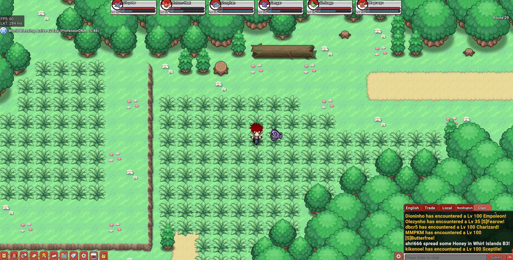
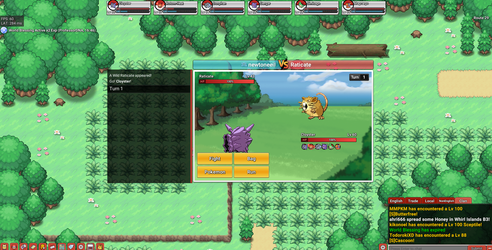
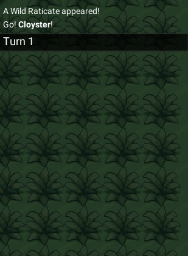
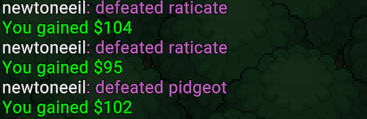

# Pokemon-Bot-With-OCR Project
Inspired by automation of tasks seen everywhere, this simply automates the online pokemon game with use of texts extracted using OCR. 

---

[pokeDemo](pokemonDemo.gif)

---

## Disclaimer
This app is designed to be a productive tool for the experimentation of cybersecurity,botting, Use of OCR and automation in game industry. It can assist cyber security experts in finding heuristics of these automated bots, their senses of how it works and even helps students learn about OCR and understand it better.

I am aware of the potential for unethical applications and am committed to preventative measures. A built-in regular interval without randomization of button presses prevents the program from acting like a real human and have embedded regular talking in the chat which can help differentiate and catch anyone using this for destroying the environment of the online website game. I will continue to develop this project responsibly, adhering to the law and ethics. I may shut down the project or add watermarks if legally required.

Ethical Use: Users are expected to use this software responsibly and legally. If using in the website, obtain their consent or immediately delete the account without trading anything.

Content Restrictions: The software includes built-in regular interval without randomization of button presses prevents the program from acting like a real human and have embedded regular talking in the chat which can help differentiate and catch anyone using this.

Legal Compliance: I adhere to all relevant laws and ethical guidelines. If legally required, we may shut down the project or add watermarks to the output.

User Responsibility: I am not responsible for end-user actions. Users must ensure their use of the software aligns with ethical standards and legal requirements.

By using this app, you agree to these terms and commit to using it in a manner that respects the rights and dignity of others.

Users are expected to use this software responsibly and legally. I am not responsible for end-user actions.

## Instructions

It is assumed that the user has basic knowledge of python before trying to run this software. This works only in Windows and preferes Visual Studio Code. 

1. Python version 3.12.x is prefferred. Anything above the version 3.6 works fine. 

2. Install tesseract ocr for python. Named as pytesseract. Make sure it works and path is well defined.

3. Install requirements.txt

pip install -r requirements.txt

4. Resolution can vary so the required coordinate of rectangle can be different in different monitors so run findCursor.py and find the combatlog position top left x1,y1 and bottom right x2,y2. Input these values in

FarmBot.py
eg:

x1=449
y1=337
x2=758
y2=389

def isEnemy():
..
img = pyautogui.screenshot(region=(449,337,758-449,389-337)) 
..
Similarly find position of chat top left x1,y1 and bottom right x2,y2. and do the same as above example and put it in 

def isFightFinish():

Note: Use Ctrl+c or Ctrl+z to exit program as no exit function is made for this infinite loop of findCursor.py

5. Run FarmBot.py
---

## Summary

This project aimed to make a automated bot by using OCR,cv2 and pyautogui in focus where I implemented a loop of bot moving, fighting, defeating, chatting of its success and then repeating this loop. I implemented the game with support of pyautogui for images, cv2 for processing, tessearct for ocr and keyboard for keys presses/mouse position. This defeats any pokemon you dont want and stop if it encounters any pokemon you want or is shiny. I learned the use of  **OCR** and how it can help automate the system/tasks that a human/player does in a game. This can be expanded to bigger and more complex games to imitate players which is a real problem in gaming industry (bots). To understand and find easiest way to detect these will be the next step of discussion.

**Keywords** — OCR, cv2, automation, game theory, bot

---

## I. Problem Description

here write about how botting helps to understand the method to stop it and understand the system better

---

## II. Background

### A. findCursorPos.py  
This simply continuously returns position of the cursor which is required as monitor have different size,resolution,etc.

### B. FarmBot.py  
This constantly checks if there is an enemy by taking a screenshot of the combat log and if it is available then it checks if it has any pokemon you want or is shiny to stop else will continue to another function to defeat the enemy. While defeating the enemy it constantly checks if chat has shown that the fight is over and you gained money. This analysis of logs are done using OCR by processing the images screenshotted using cv2 with otsu threshold in gray scale.

---

## III. Program Description

The screenshotted images must look like this. You can check it at the directory of this. You can change the neededPokemon or update it. This has been experimented on poke-nexus

The initial entire pic is this, where the bot keeps moving left and right in regular intervals.

---

---

The bot will then encounter pokemon and this is the full picture from where you have select the region of combat and chat as told in instructions.

---

---

The bot will then use OCR to analyze texts and will store string between wild and appeared to further analyze what you are looking for.

---

---

The bot will then analyze chatLog until it encounter you gain $ which indicates it's victory and stop fighting and automatically writes about the victory then goes back into the loop.

---

---

## IV. Tests and Results

I tested the bot by making it run for over 5 hours to which it detected enemy name accurately , type of enemy (wild, shiny, elite) accurately, found battle end accurately. The result was in 10 second it earned about 90-130 $ in game currency. So taking average of 100$ poke currency this bot successfully earned 36,000$ in an hour and 1,728,000$ poke currency able to entirely disrupt the online gaming market and trading. This teaches us the impact of automation of tasks in market and trading inside a game where grinding is a core function (eg: Pokemon, WoW)

---

## V. Lessons Learnt

I learnt about implication of such automation which could take over the enjoyment, competitiveness of a game and its overall look would not be as good. World of warcraft is another game where more addition of features in current bot could automate tasks like grinding,looting, professions(skinning, tailoring,mining, etc. ) which could all affect the environment of a game. This can easily be simulated in real world where simple tasks of humans can later be imitated by robots. No need of AI for simple tasks as robot will be far more efficient and non - complaining. Whereas AI is overkill for such tasks. 

Overall, I understood and hopefully you all will understand how to integrate OCR with region-based screenshots, opencv filters, GUI automation with feedback loops, bot-human imitation, explotative repetitive behaviour,etc. This should give inpsiration and rise to designing anti-bot defense and automation protection act.

-----------------
